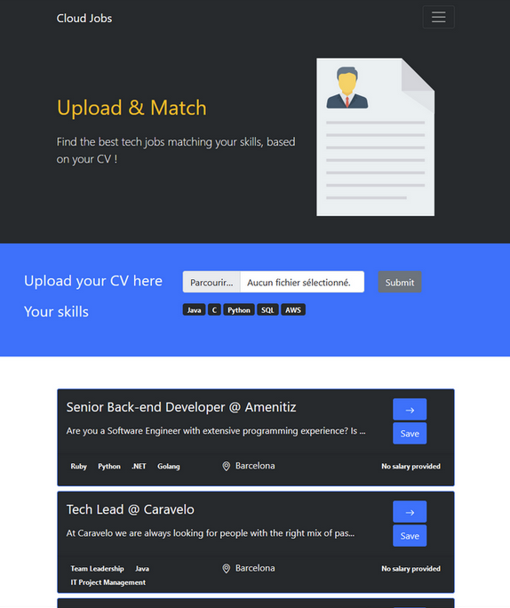
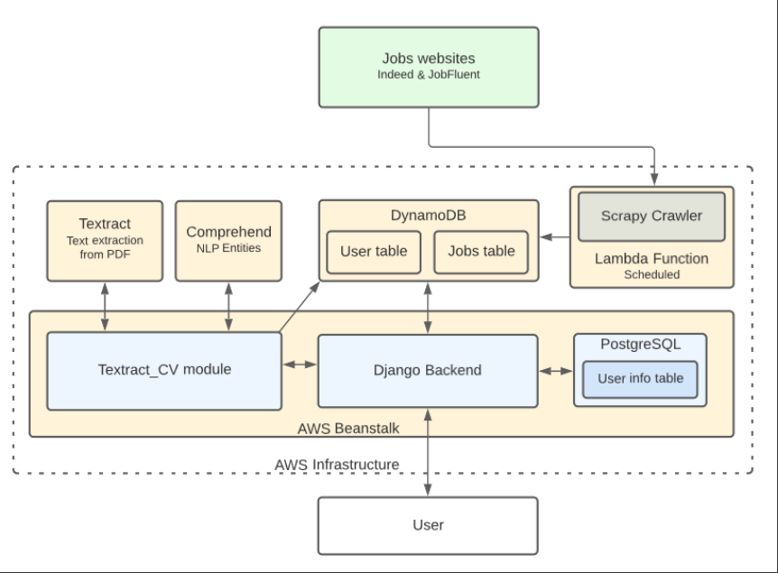

# CCBDA-Project
Personalized Job board by matching Resume skills to job posts using AI.
Team project for CCBDA 22' Class.

Sample:

Architecture:

## Main Branch

Related to main features extract and match skills.

## Indeed-scrapper Branch

Performs the scrapping of the job websites Indeed and JobFluent.

## Auth-int Branch

Related to Frontend + Backend and integration of the Textract module
